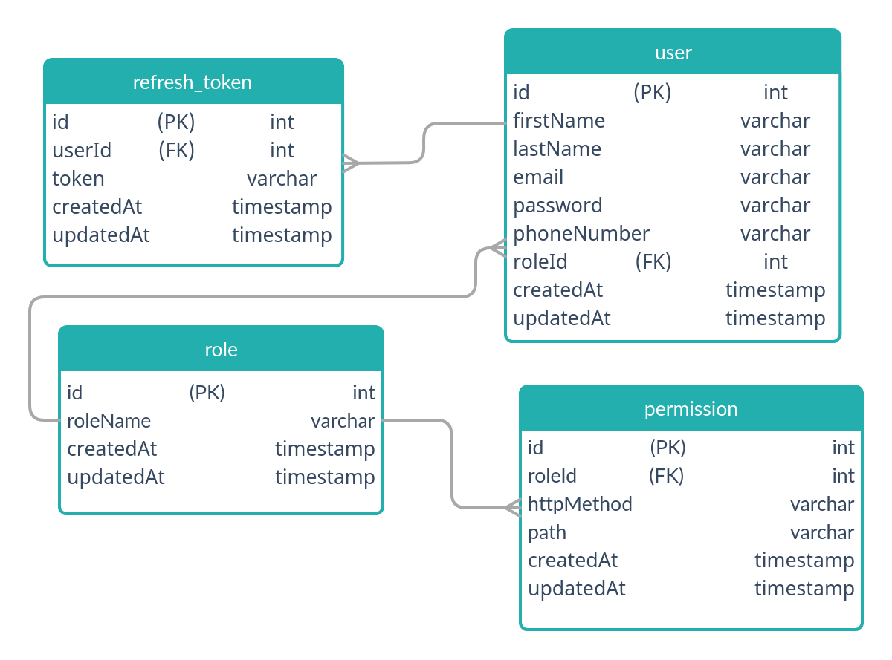

# Auth Service

[](https://standardjs.com)

A user authentication and authorization service.

## Getting Started

To get you a copy of the production version of the project up and running on your local machine run:

```shell script
docker-compose up -d --force-recreate
```

## Database Design



## Contribution

check [contribution guide](./CONTRIBUTION.md)

## Api

### `POST /users`

Register a new user to the system.

Request:

```js
{
    firstName:   String,
    lastName:    String,
    email:       String,
    password:    String,
    phoneNumber: String
}
```

Response:

```js
{
    user : {
        roleId : Number,
        id : Number,
        firstName : String,
        lastName : String,
        email : String,
        phoneNumber : String
    },
    accessToken : String,
    refreshToken : String
}
```

Status codes:

```yaml
201:
  The user created and the user info returned.
422:
  Error in one or more inputs format as a weak password or putting an invalid email.
409:
  There's an account with the same email.
```

### `POST /users/login`

Authenticate user credentials and log him into the system.

Request:

```js
{
    email:       String,
    password:    String,
}
```

Response:

```js
{
    user : {
        roleId : Number,
        id : Number,
        firstName : String,
        lastName : String,
        email : String,
        phoneNumber : String
    },
    accessToken : String,
    refreshToken : String
}
```

Status codes:

```yaml
200:
  The user credentials are correct and he logged into the system.
401:
  The user credentials are wrong.
```
